# NIGAA Petition Tracker - Case Flow Diagrams

> Complete visualization of petition workflows, user roles, status transitions, and case routing paths.

---

## Table of Contents

1. [User Roles Overview](#1-user-roles-overview)
2. [Master Petition Lifecycle](#2-master-petition-lifecycle)
3. [Path A: Direct Enquiry Flow](#3-path-a-direct-enquiry-flow-no-permission-required)
4. [Path B: Permission-Based Flow](#4-path-b-permission-based-flow-po-approval-required)
5. [DEO (Data Entry Operator) Flow](#5-deo-data-entry-operator-flow)
6. [CVO / DSP Flow](#6-cvo--dsp-flow)
7. [Field Inspector Flow](#7-field-inspector-flow)
8. [Personal Officer (PO) Flow](#8-personal-officer-po-flow)
9. [CMD / CGM-HR Flow](#9-cmd--cgm-hr-flow)
10. [Preliminary to Detailed Enquiry Conversion](#10-preliminary-to-detailed-enquiry-conversion)
11. [Media Source - Direct Lodge Flow](#11-media-source---direct-lodge-flow)
12. [Beyond SLA Escalation Flow](#12-beyond-sla-escalation-flow)
13. [PO Direct Lodge (No Enquiry Needed)](#13-po-direct-lodge-no-enquiry-needed)
14. [Complete Status Transition Matrix](#14-complete-status-transition-matrix)
15. [6-Stage Workflow Summary](#15-6-stage-workflow-summary)
16. [SLA Timelines](#16-sla-timelines)

---

## 1. User Roles Overview

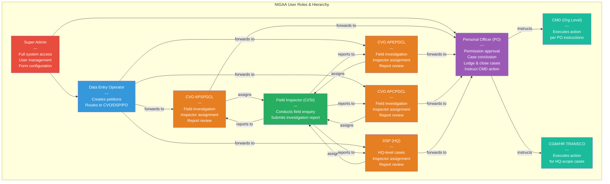

---

## 2. Master Petition Lifecycle

> This is the complete overview showing ALL possible paths a petition can take.

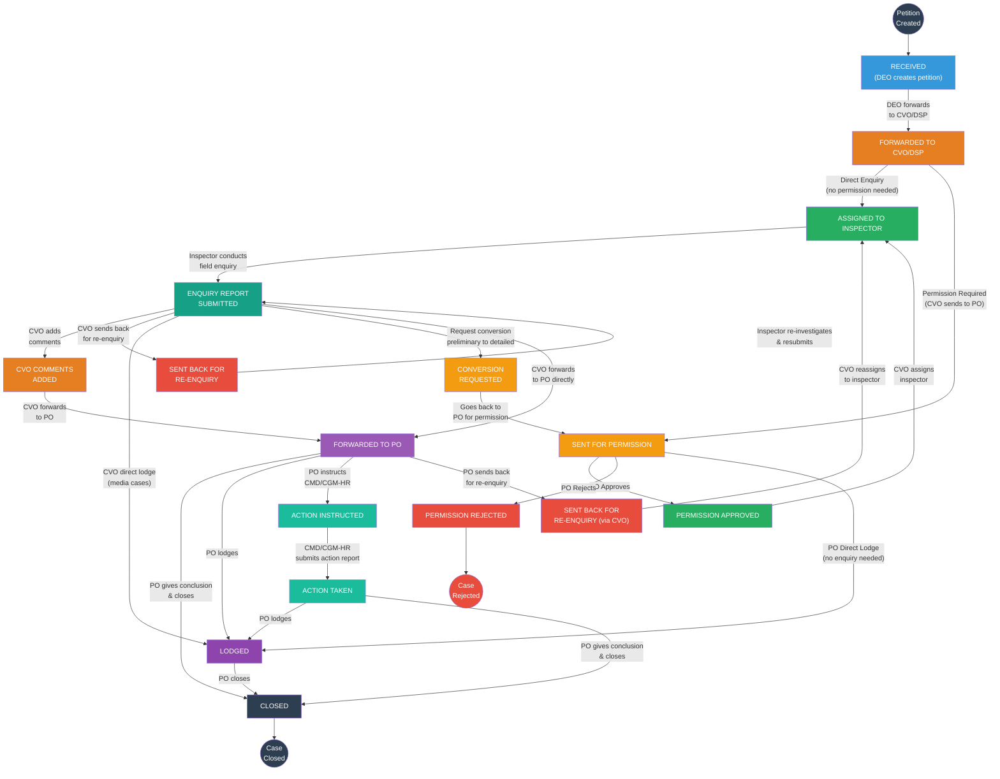

---

## 3. Path A: Direct Enquiry Flow (No Permission Required)

> Used when the petition type does not require PO approval before investigation.

```mermaid
flowchart TD
    A1["DEO Creates Petition<br/>permission_request_type = 'direct_enquiry'"]
    A2["Status: RECEIVED"]
    A3["DEO Forwards to CVO/DSP<br/>(selects target office)"]
    A4["Status: FORWARDED TO CVO/DSP"]
    A5["CVO/DSP Receives Petition<br/>Sets E-Receipt Number<br/>Selects Enquiry Type:<br/>Detailed or Preliminary"]
    A6["CVO/DSP Assigns Field Inspector<br/>Uploads Memo/Instructions"]
    A7["Status: ASSIGNED TO INSPECTOR"]
    A8["Inspector Conducts<br/>Field Investigation"]
    A9["Inspector Submits Report<br/>- Conclusion of Enquiry<br/>- Recommendations<br/>- Report PDF"]
    A10["Status: ENQUIRY REPORT SUBMITTED"]
    A11["CVO/DSP Reviews Report<br/>- Adds Comments<br/>- Uploads Consolidated Report"]
    A12["Status: CVO COMMENTS ADDED"]
    A13["CVO/DSP Forwards to PO"]
    A14["Status: FORWARDED TO PO"]
    A15{"PO Decision"}
    A16["PO Gives Conclusion<br/>& Closes Case"]
    A17["PO Instructs CMD/CGM-HR<br/>for Action"]
    A18["Status: ACTION INSTRUCTED"]
    A19["CMD/CGM-HR Takes Action<br/>Submits Action Report"]
    A20["Status: ACTION TAKEN"]
    A21["PO Lodges Petition"]
    A22["Status: LODGED"]
    A23["PO Closes Petition"]
    A24["Status: CLOSED"]

    A1 --> A2 --> A3 --> A4 --> A5 --> A6 --> A7 --> A8 --> A9 --> A10 --> A11 --> A12 --> A13 --> A14 --> A15

    A15 -->|"Conclusion Only"| A16 --> A24
    A15 -->|"Action Needed"| A17 --> A18 --> A19 --> A20 --> A21 --> A22 --> A23 --> A24
    A15 -->|"Direct Lodge"| A21

    style A1 fill:#3498db,color:#fff
    style A2 fill:#3498db,color:#fff
    style A4 fill:#e67e22,color:#fff
    style A7 fill:#27ae60,color:#fff
    style A10 fill:#16a085,color:#fff
    style A12 fill:#e67e22,color:#fff
    style A14 fill:#9b59b6,color:#fff
    style A18 fill:#1abc9c,color:#fff
    style A20 fill:#1abc9c,color:#fff
    style A22 fill:#8e44ad,color:#fff
    style A24 fill:#2c3e50,color:#fff
```

---

## 4. Path B: Permission-Based Flow (PO Approval Required)

> Used when the petition requires PO permission before CVO/DSP can begin investigation.

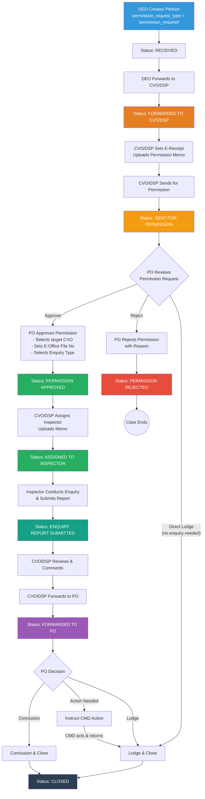

---

## 5. DEO (Data Entry Operator) Flow

> Detailed view of all actions available to the Data Entry Operator.

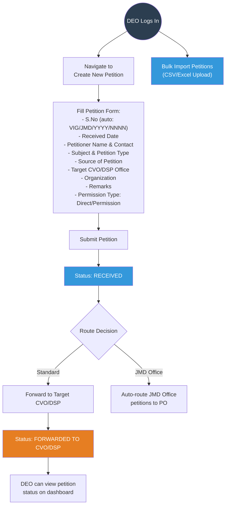

---

## 6. CVO / DSP Flow

> Detailed view of all actions available to CVO/DSP officers at each status.

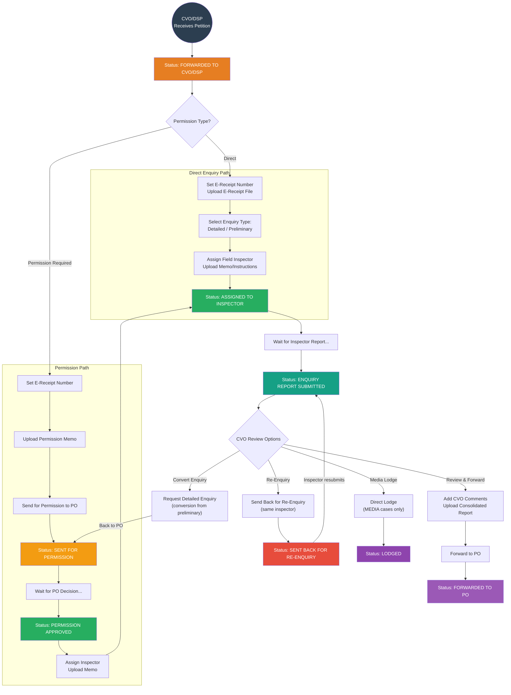

---

## 7. Field Inspector Flow

> Detailed view of the field inspector's investigation and reporting workflow.

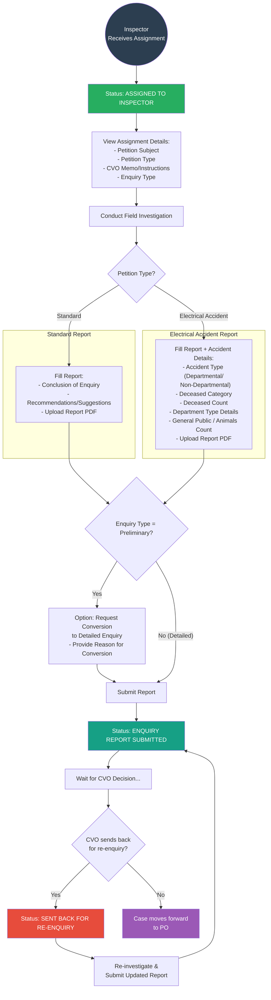

---

## 8. Personal Officer (PO) Flow

> Detailed view of all actions available to the PO at each stage.

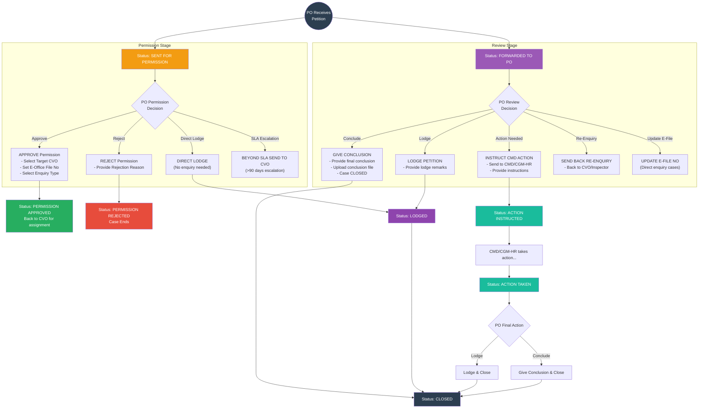

---

## 9. CMD / CGM-HR Flow

> Detailed view of the CMD/CGM-HR action execution workflow.

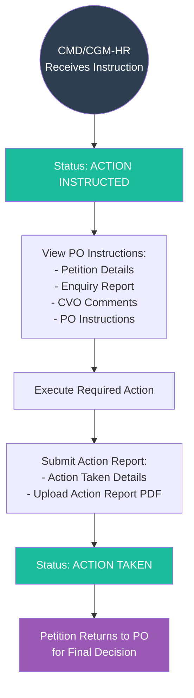

---

## 10. Preliminary to Detailed Enquiry Conversion

> Special flow when a preliminary enquiry needs to be upgraded to a detailed enquiry.

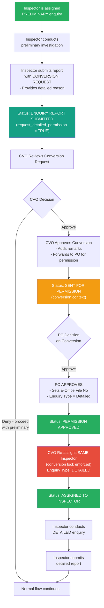

**Key Rule:** When converting from preliminary to detailed, the **same inspector** must be reassigned. The system enforces a "conversion lock" to prevent reassignment to a different inspector.

---

## 11. Media Source - Direct Lodge Flow

> Special shortcut flow for petitions sourced from Electronic & Print Media.

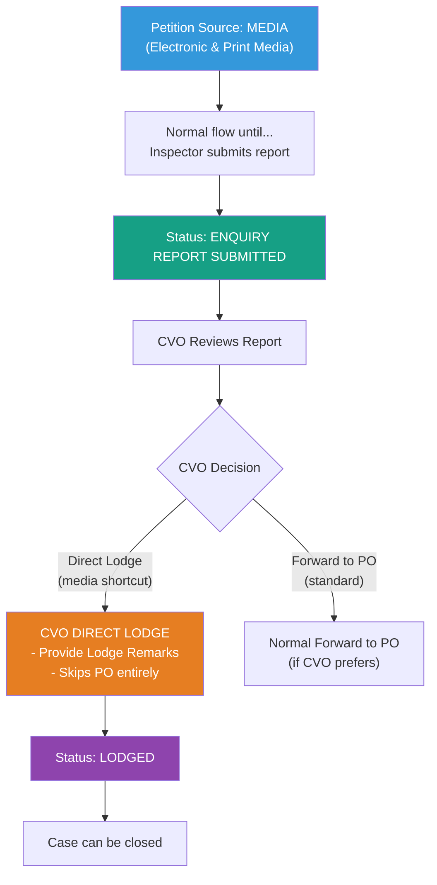

**Note:** This shortcut is ONLY available for petitions with `source_of_petition = 'Electronic & Print Media'`.

---

## 12. Beyond SLA Escalation Flow

> Special flow when a petition exceeds the 90-day SLA deadline.

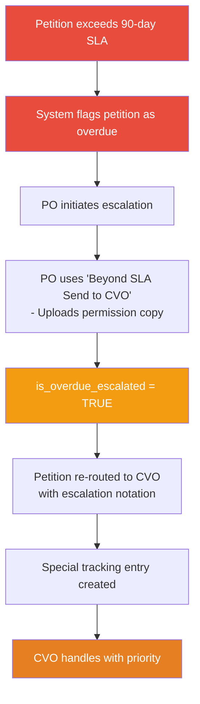

---

## 13. PO Direct Lodge (No Enquiry Needed)

> Flow when PO determines a petition does not require any field investigation.

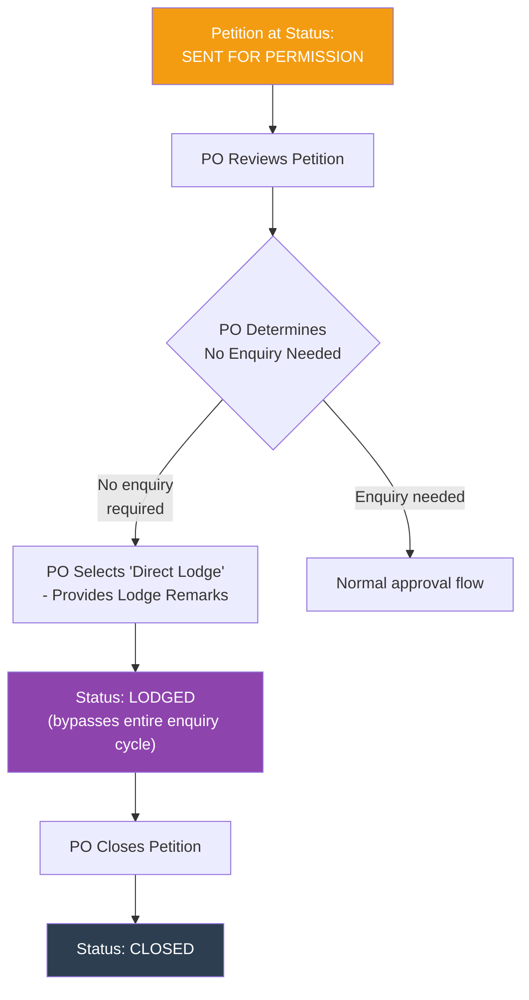

---

## 14. Complete Status Transition Matrix

> Shows every status and which role can trigger transitions.

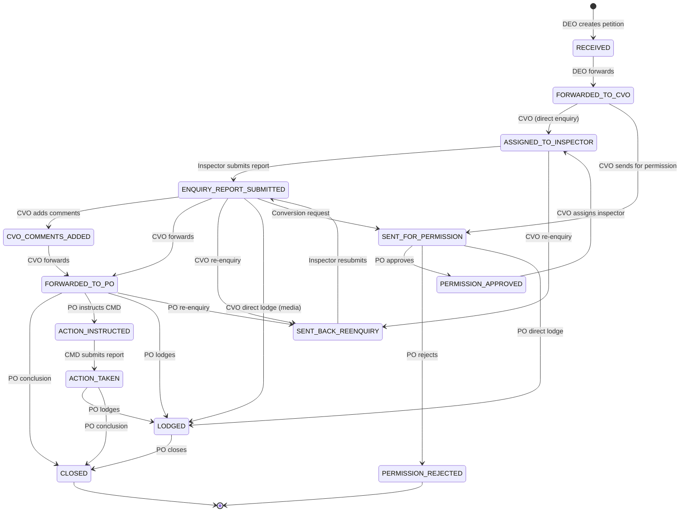

---

## 15. 6-Stage Workflow Summary

```mermaid
flowchart LR
    subgraph "STAGE 1<br/>Petition Initiated"
        S1A["RECEIVED"]
        S1B["FORWARDED TO CVO"]
        S1C["SENT FOR PERMISSION"]
        S1D["PERMISSION APPROVED"]
        S1E["PERMISSION REJECTED"]
    end

    subgraph "STAGE 2<br/>Enquiry In Progress"
        S2A["ASSIGNED TO INSPECTOR"]
        S2B["SENT BACK RE-ENQUIRY"]
    end

    subgraph "STAGE 3<br/>Report Finalized"
        S3A["ENQUIRY REPORT SUBMITTED"]
        S3B["CVO COMMENTS ADDED"]
        S3C["FORWARDED TO PO"]
    end

    subgraph "STAGE 4<br/>Action Pending"
        S4A["ACTION INSTRUCTED"]
        S4B["ACTION TAKEN"]
    end

    subgraph "STAGE 5<br/>Lodged"
        S5A["LODGED"]
    end

    subgraph "STAGE 6<br/>Closed"
        S6A["CLOSED"]
    end

    S1A --> S1B --> S1C --> S1D
    S1D --> S2A
    S2A --> S3A
    S3A --> S3B --> S3C
    S3C --> S4A --> S4B
    S4B --> S5A --> S6A

    style S1A fill:#3498db,color:#fff
    style S1B fill:#3498db,color:#fff
    style S1C fill:#3498db,color:#fff
    style S1D fill:#3498db,color:#fff
    style S1E fill:#e74c3c,color:#fff
    style S2A fill:#27ae60,color:#fff
    style S2B fill:#27ae60,color:#fff
    style S3A fill:#e67e22,color:#fff
    style S3B fill:#e67e22,color:#fff
    style S3C fill:#e67e22,color:#fff
    style S4A fill:#1abc9c,color:#fff
    style S4B fill:#1abc9c,color:#fff
    style S5A fill:#8e44ad,color:#fff
    style S6A fill:#2c3e50,color:#fff
```

---

## 16. SLA Timelines

```mermaid
gantt
    title Petition SLA Timelines by Case Type
    dateFormat  X
    axisFormat %d days

    section Preliminary Enquiry
    SLA Deadline :crit, 0, 15

    section Media Source Cases
    SLA Deadline :crit, 0, 45

    section Electrical Accident
    SLA Deadline :crit, 0, 45

    section Standard Detailed Enquiry
    SLA Deadline :crit, 0, 90
```

| Case Type | SLA Target | Escalation |
|---|---|---|
| Preliminary Enquiry | 15 days | Flagged as overdue |
| Media Source Cases | 45 days | Flagged as overdue |
| Electrical Accident | 45 days | Flagged as overdue |
| Standard Detailed Enquiry | 90 days | PO can escalate via "Beyond SLA" action |

---

## Quick Reference: Who Does What

| Role | Creates | Assigns | Investigates | Reviews | Approves | Acts | Closes |
|---|---|---|---|---|---|---|---|
| **Super Admin** | - | - | - | - | - | - | System Config |
| **DEO** | Yes | - | - | - | - | - | - |
| **CVO/DSP** | - | Yes | - | Yes | - | - | - |
| **Inspector** | - | - | Yes | - | - | - | - |
| **PO** | - | - | - | Yes | Yes | - | Yes |
| **CMD/CGM-HR** | - | - | - | - | - | Yes | - |

---

## Petition Types Handled

| # | Petition Type | Special Handling |
|---|---|---|
| 1 | Bribe | Standard flow |
| 2 | Corruption | Standard flow |
| 3 | Harassment | Standard flow |
| 4 | Electrical Accident | Extra accident detail fields in inspector report |
| 5 | Misconduct | Standard flow |
| 6 | Works Related | Standard flow |
| 7 | Irregularities in Tenders | Standard flow |
| 8 | Illegal Assets | Standard flow |
| 9 | Fake Certificates | Standard flow |
| 10 | Theft/Misappropriation of Materials | Standard flow |
| 11 | Other | Standard flow |

---

## Petition Sources

| # | Source | Special Rules |
|---|---|---|
| 1 | Electronic & Print Media | CVO can directly lodge after enquiry report |
| 2 | Public (Individual) | Standard flow |
| 3 | Government | Requires `govt_institution_type` selection |
| 4 | Sumoto | Standard flow |
| 5 | O/o CMD (Office of CMD) | Standard flow |

---

*Document generated for NIGAA Petition Tracker - AP TRANSCO Vigilance & Investigation System*
